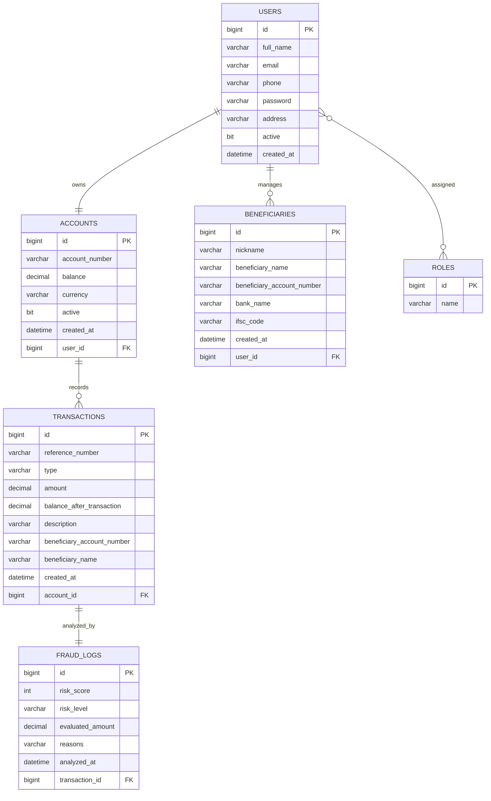

# ER Diagram Structure

## Normalization Notes

- `users`, `roles`, and `user_roles` implement a normalized many-to-many authorization model.
- `accounts` is separated from `users` to support future account product expansion.
- `beneficiaries` is independent so customers can manage reusable payees.
- `transactions` stores immutable transfer history for auditability.
- `fraud_logs` decouples AI fraud analysis from transaction storage.
